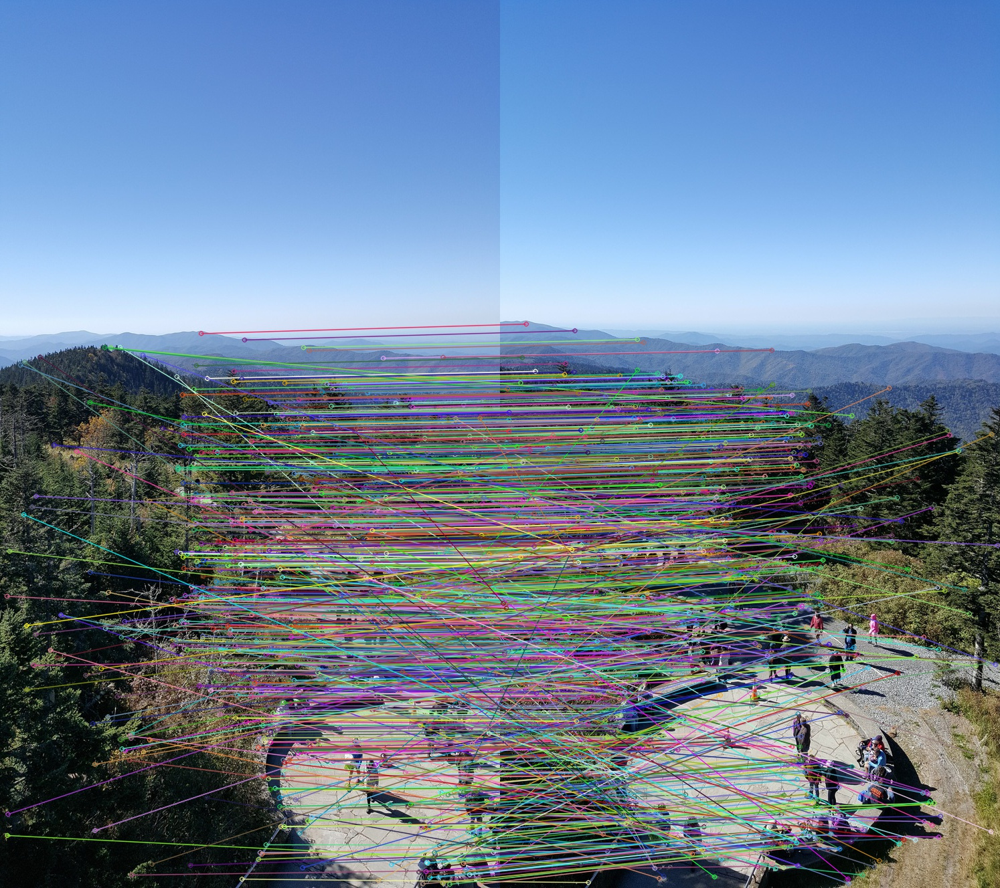
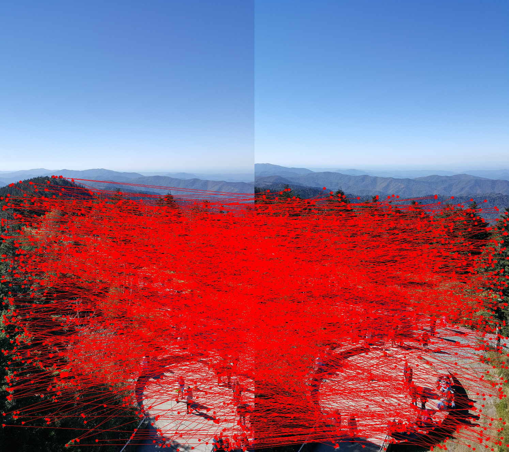

# Project 5: Automated Panoramic Image Mosaicing
## Introduction
In this project, a fully automated approach for robust homography estimation is implemented. 

Building upon SIFT/SURF feature descriptors, this project introduces the RANdom SAmpling Consensus (RANSAC) algorithm for outlier rejection, coupled with a linear least squares approach for initial homography estimation. The subsequent LM-based refinement gives a more robust homography estimation.

After the above steps, a panoramic view by “stitching” together five (or more) overlapping views of the same scene is then generated. 

## Steps
### Step 1: Feature Point Extraction
Use SIFT or SURF and a force matcher that directly compares the feature vectors of interest points.

### Step 2: Outlier rejection
Random Sample Consistency (RANSAC) is a method for estimating mathematical models from data sets containing outliers.

****
**RANSAC:**  The key idea behind RANSAC algorithm is that starting with a pair of images and an initial set of correspondences, you randomly pick a few correspondences, say five or six at a time. This randomly picked set of point would give you an estimate of homography using least squares method explained earlier. Use this homography estimation to project all the initial correspondences from the domain to range image. Now count the number of inliers (use your answer to the first theoretical question to decide how to find these “inliers”). Keep the homography that returns the largest number of inliers.
****

To implement the RANSAC algorithm, we need to determine several parameters.

* First, a decision threshold $\delta$ to decide whether a correspondence is an inlier is commonly set as $\delta = 3\sigma$. In this assignment, $\delta = 5$ is used according to the lecture ($\sigma$ is set to a small number between 0.5 and 2).
        
* $p$ stands for the probability that at least one of the $N$ trials is free of outliers. We set the number of trials $N = \frac{\ln(1-p)}{\ln[1-(1-\epsilon)^n]}$ so that $p = 0.99$.

* $\epsilon = 0.6$ is used to assume roughly $60\%$ of the correspondences are false. $n$ is the number of correspondences selected in one trial for estimating homography. Therefore, we have $N = 448$ trials in total.

* The number of inliers in the data is set to be $M \approx (1-\epsilon)\cdot n_{total}$.

Then, we keep the homography that has most inliers and the indices of those correspondences.

    
    <figcaption>Inliers</figcaption>

    
    <figcaption>Outliers</figcaption>

### Step 3: Homography estimation 
Use a Linear Least-Squares method with the help of inliers obtained from the previous step to estimate the homography. 

****
**Linear Least-Squares Minimization:** A set of correspondences gives you an over-determined system of homogeneous equations, i.e., $Ax = 0$. The SVD of $A$ would give you $A = UDV^T$. The required solution is the last column vector of $V$ which will be the eigenvector of $A^TA$ corresponding to the smallest singluar value in $D$.
****

In this project, linear least-squares minimization is addressed with inhomogeneous equations. Compared to homogeneous equations, we assume arbitrarily that $h_{33} = 1$. This gives us two equations for one correspondence $$\begin{bmatrix} 0 & 0 & 0 & -w'x & -w'y & -w'w & y'x & y'y \\ 
    w'x & w'y & w'w & 0 & 0 & 0 & -x'x & -x'y \end{bmatrix} \begin{bmatrix} 
    h_{11} \\ h_{12} \\ h_{13} \\ h_{21} \\ h_{22} \\ h_{23} \\ h_{31} \\ h_{32} \end{bmatrix} = \begin{bmatrix} -y'w \\ x'w \end{bmatrix}$$
    
If we have more than four correspondences, we have an over-determined system of equations $A\vec{h} = \vec{b}$. The best choice for $\vec{h}$ will minimize $\| \vec{b} - A\vec{h} \|$. Since $A^T(\vec{b} - A\vec{h}) = \vec{0}$, the linear least squared solution for $\vec{h}$ must satisfy $(A^TA)\vec{h} = A^T\vec{b}$, which yields $\vec{h} = (A^TA)^{-1}A^T\vec{b} = A^+\vec{b}$ where $A^+$ is known as pseudoinverse of $A$.

### Step 4: Homography Refinement
Use the Nonlinear Least-Squares approach for homography refinement. 

****
**Levenberg-Marquardt (LM) Algorithm:** LM combines the solution of GN and GD: $$({J_{\vec{f}}}^T J_{\vec{f}} + \mu I)\vec{\delta_p} = {J_{\vec{f}}}^T\vec{\epsilon}(\vec{p_k})$$ where small values of the damping parameter $\mu$ result in a Gauss-Newton update and large values of $\mu$ result in a gradient descent update. If any iteration gives us worse approximation, that is, $C(\vec{p_k}) - C(\vec{p_{k+1}}) < 0$, then $\mu$ is increased. Otherwise, as the solution improves, $\mu$ is decreased, the LM method approaches the Gauss-Newton method, and the solution typically accelerates to the local minimum.
****

In this project, an open-source implementation for LM-Algorithm is used. 

### Step 4: Panaroma Image Generation
Use all the pairwise homographies to project all the views on to a fixed common frame.

